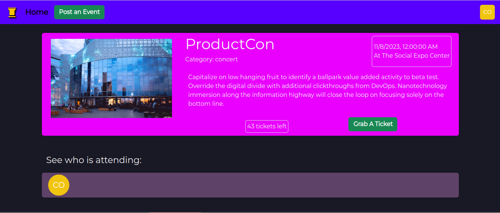

# Tower

Tower is a full-stack application for posting and securing tickets to events. 

## Technologies Used:
• Vue.js as a frontend JavaSript framework and Vue-Router for smooth navigation

• Express and Node.js for the backend

• MongoDB as the database, using Mongoose as the ORM

• Auth0 user authentication

## Key Features:
Events: Users can post new events, which they can then cancel if necessary, as well as secure multiple tickets to events and comment on them, leading to conversation between users. 

Many-to-many relationships: When a user gets tickets to an event, they are added to the attendee list of that event and they can see all tickets they have procured on their account page. Users can buy many tickets to the same event, and many users can get tickets for many events.

## What I learned from this project:
The development of Tower was a pivotal learning experience that strengthened my ability to independently build full-stack applications. I wrestled with the intricacies of one-to-many and many-to-many data relationships between user accounts, events, tickets, and comments, handled on the back end by Node.js, but I feel as if I devised an effective way to manage these relationships on the front end--it really made me realize why I enjoy the versatility and creativity of the front end. I also enjoyed practicing more with Vue.js. Tower, with its diverse and interconnected features, provided an invaluable opportunity to apply theoretical knowledge to real-world scenarios, cementing my understanding of full-stack development.
